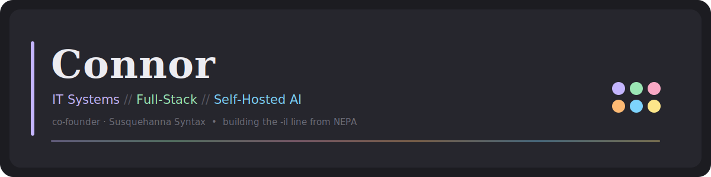

<div align="center">



</div>

---

### `whoami`

CS grad (Penn State) and full-time **IT Support Specialist** keeping several regional campuses running — but the title undersells it. I architect cross-campus asset-reconciliation systems, ship Power Platform tooling, and spend the off-hours co-founding **[Susquehanna Syntax](#)** and building a self-hosted AI stack in my basement.

Open-core by default. Everything ships under one house style and a stubborn `-il` naming convention. Based in NEPA, quietly trying to turn the Wyoming Valley into a place you don't have to leave to do this work.

```text
role      →  IT Support Specialist  ·  cross-campus systems  (Penn State)
building  →  Susquehanna Syntax  ·  open-core, self-hosted, design-led
homelab   →  AMD MI50 32GB · ROCm/gfx906 · llama.cpp router · ~48–51 t/s
cert      →  Certified Extron Control Professional
elsewhere →  NEPA transit & regional-dev nerd  ·  the Trillium Line will happen
```

---

### Stack


---

### The `-il` line — Susquehanna Syntax

| Project | What it is | Stack |
|---|---|---|
| **Sigil** | Self-hosted AI chat app + my primary model testbed — SSE streaming, workspace multi-tenancy, Fernet-encrypted keys, plugin system | Django 5 · HTMX |
| **Vigil** | Self-hosted infra monitoring & endpoint management with LLM-powered incident narration and a community task hub | Django/DRF · Celery · TimescaleDB · Go agent |
| **Portil** | Authenticated reverse-proxy dashboard — Ed25519 task signing, bcrypt device tokens, wildcard Cloudflare ingress | Go |
| **Urbanil** | 3D urban-planning desktop suite for sketching cities and transit | Java · jMonkeyEngine |
| **Meetil** | A When2Meet that doesn't hurt to look at | — |
| **Turnstil** | QR event check-in + contact-share PWA (senior capstone) | Django |

<sub>Open-core. One design language across all of it: charcoal base, six pastel accents, Fraunces / DM Sans / IBM Plex Mono, flat and calm.</sub>

---

### In the lab right now

- **Home inference stack** — AMD **MI50 32GB** (gfx906) on **ROCm**, `rocBLAS` rebuilt from source, `llama-server` running in **router mode** as a systemd unit with MTP/speculation passthrough. Benchmarking ~**48–51 t/s**.
- **Agentic loops** — *Claude-as-Architect → local-model-as-Executor* overnight coding runs via a homegrown MCP bridge.
- **A publishable idea** — token-level **Mixture-of-Models** routing between two GGUFs that share a tokenizer. Current tooling doesn't do it; I'm poking at the gap.
- **The boring-but-real stuff** — mergerfs + btrfs RAID1, Caddy reverse proxy, Gluetun, Portainer, and a hard-won respect for *not* running snap Docker near a Postgres WAL.

---

### Outside the terminal

I write transit proposals for fun. There's a real one — the **Trillium Line**, a multi-color regional rail concept (RBMN partnership, public-capital estimate and all) aimed at the LCTA and the NEPA MPO. The long game: anchor a tech shop here and give the valley a reason to keep its talent.

Also: Minecraft modpack dev (**Entropy³**, GregTech/KubeJS), and a weakness for well-made tooling.

---

<div align="center">

### Stats


<br/>


</div>

---

<div align="center">
<sub><code>#1c1c21</code> · lavender · mint · rose · peach · sky · lemon — <i>Susquehanna Syntax</i></sub>
</div>
